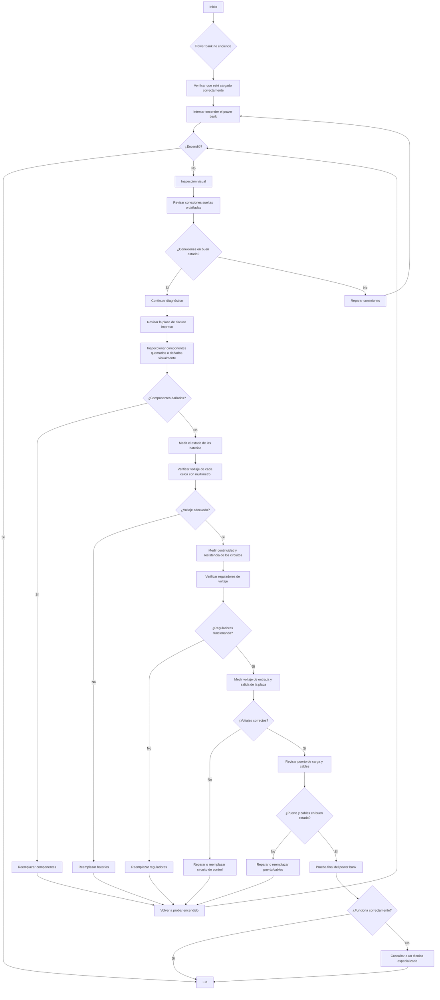

# Diagnostico-Power-Bank
Metodología para el diagnostico de dispositivo electrónico, Power Bank

## Datos técnicos

| Item | Descripción | Valor |
| --------- | --------- | --------- |
|  1         | Modelo          |           |
|  2         | Marca          |           |
|  3         | Serial          |           |

